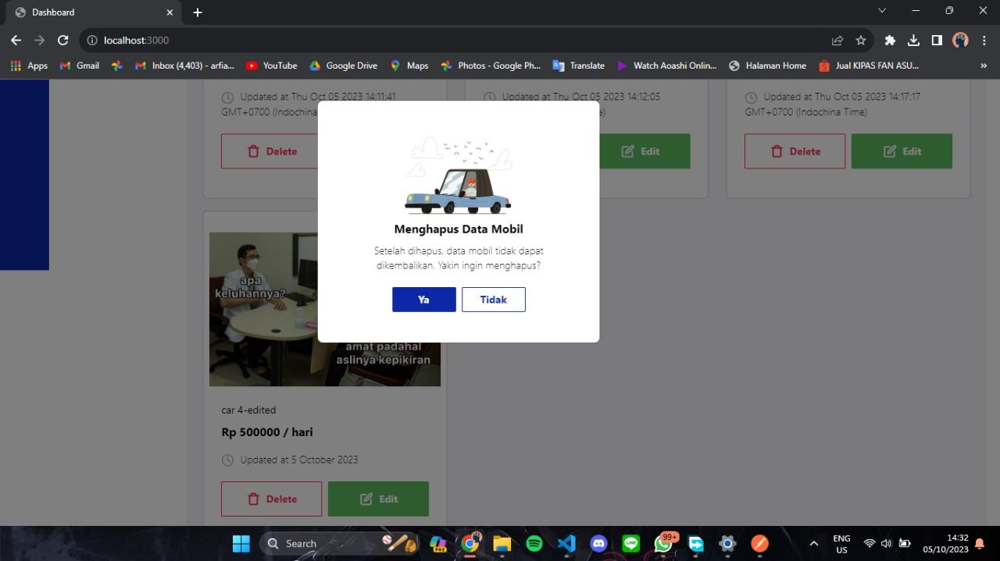

# Challenge Chapter 04 FSW Binar Academy x KM Batch 5

This project is for completing chapter 4 challenge "Car Management Dashboard".

## Installation

You need to install NodeJS, NPM, and MongoDB on your system first.

## Run Locally

To run this project, you will need to add the following environment variables to your .env file

`PORT`

`DATABASE_URI`

Clone the project

```bash
  git clone https://github.com/ukinon/Challenge-Chapter-04.git
```

Go to the project directory

```bash
  cd Challenge-Chapter-04
```

Install dependencies

```bash
  npm install
```

Start the server

```bash
  npm run start
```

You can access your app at https://localhost:port

## Screenshots

### Home Page


### Create Car Page


### Edit Car Page


### Create Car Notification


### Edit Car Notification


### Delete Car Modal



### Delete Car Notification


### Image Validation Notification


## Postman Usage

### Get all cars

```bash
GET /api/v1/cars
```

#### Response

```bash
{
    "status": "success",
    "requestTime": "2023-10-05T07:12:09.184Z",
    "length": 2,
    "data": {
        "Cars": [
            {
                "_id": "651d43634ff70adedaed0fa7",
                "name": "car 1",
                "size": "medium",
                "price": 222222,
                "date": "Thu Oct 05 2023 14:11:41 GMT+0700 (Indochina Time)",
                "img": "imageUploads\\1696489901647-carbon (1).png",
                "__v": 0
            },
            {
                "_id": "651d5deb4ff70adedaed0fc4",
                "name": "car 2",
                "size": "large",
                "price": 33333,
                "date": "Thu Oct 05 2023 14:12:05 GMT+0700 (Indochina Time)",
                "img": "imageUploads\\1696489925883-carbon (1).png",
                "__v": 0
            }
        ]
    }
}

```

### Create Car

```bash
POST /api/v1/cars
```

#### Body

```bash
{
  "name": "car 3",
  "price": 9000,
  "size": small,
  "image": [file]
}
```

#### Response

```bash
{
    "status": "success",
    "data": {
        "Car": {
            "name": "car 3",
            "size": "small",
            "price": 9000,
            "date": "Thu Oct 05 2023 14:14:48 GMT+0700 (Indochina Time)",
            "img": "imageUploads\\1696490088156-carbon.png",
            "_id": "651e6268a2da29faaa734ef0",
            "__v": 0
        }
    }
}
```

### Edit Car

```bash
PATCH /api/v1/cars/:id
```

#### Body

```bash
{
  "name": "car 3-edited"
}
```

#### Response

```bash
{
    "status": "success",
    "data": {
        "Car": {
            "_id": "651e6268a2da29faaa734ef0",
            "name": "car 3-edited",
            "size": "small",
            "price": 9000,
            "date": "Thu Oct 05 2023 14:17:17 GMT+0700 (Indochina Time)",
            "img": "imageUploads\\1696490088156-carbon.png",
            "__v": 0
        }
    }
}
```

### Get car by id

```bash
GET /api/v1/cars/:id
```

#### Response

```bash
{
    "status": "success",
    "data": {
        "car": {
            "_id": "651e6268a2da29faaa734ef0",
            "name": "car 3-edited",
            "size": "small",
            "price": 9000,
            "date": "Thu Oct 05 2023 14:17:17 GMT+0700 (Indochina Time)",
            "img": "imageUploads\\1696490088156-carbon.png",
            "__v": 0
        }
    }
}

```

### Delete Car

```bash
DELETE /api/v1/:id
```

#### Response

```bash
{
    "status": "success",
    "message": "data sudah berhasil di hapus"
}
```

## ERD


## Links

### Home Page

```http
http://localhost:PORT/
```

### Create Car Page

```http
http://localhost:PORT/create
```

### Edit Car Page

```http
http://localhost:PORT/edit/:id
```
